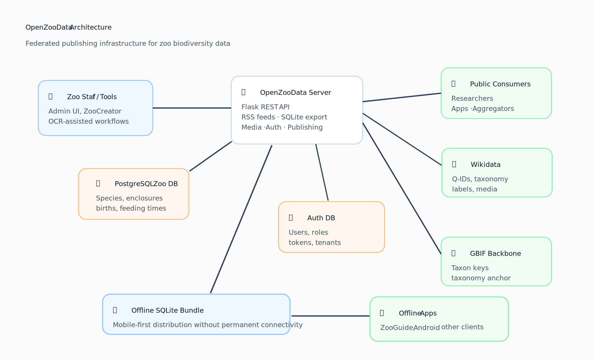
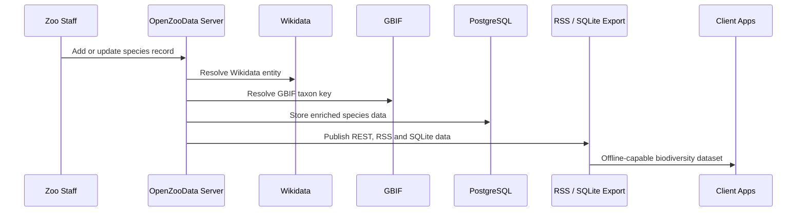
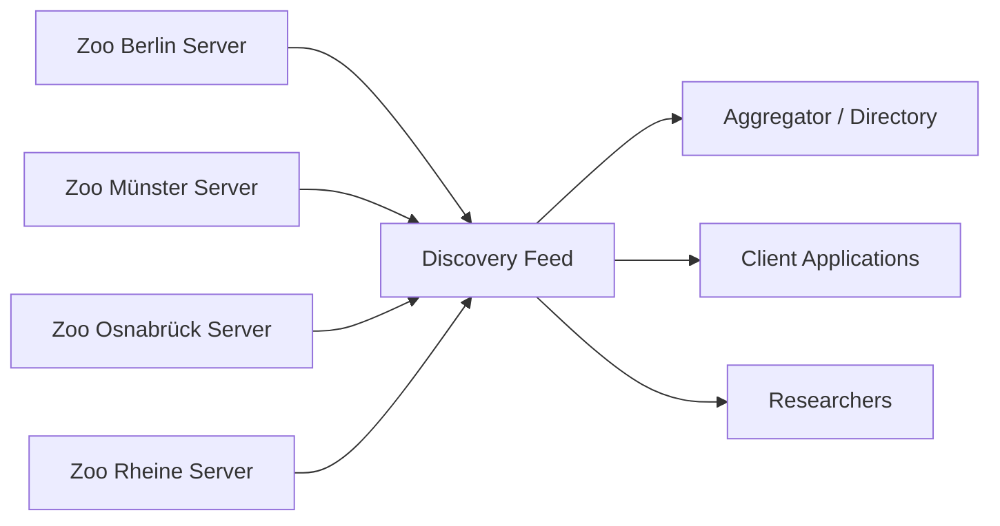
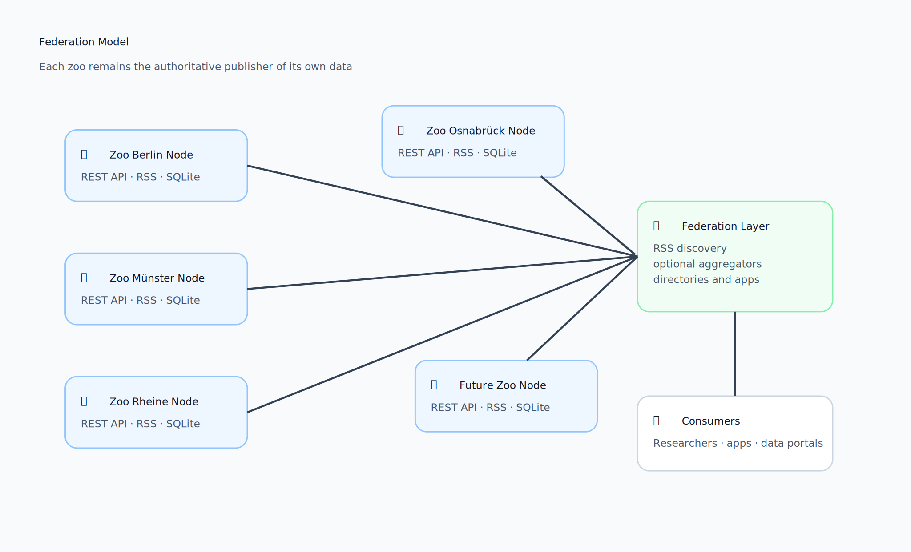
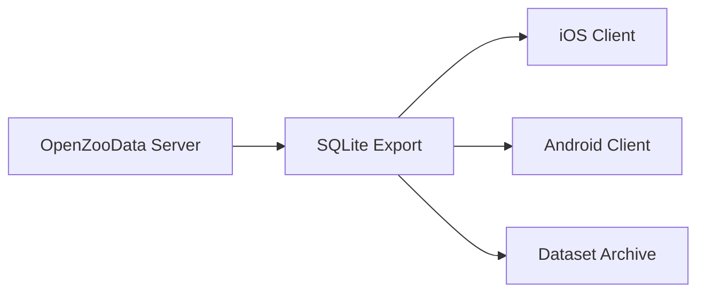

# OpenZooData

> **Open infrastructure for federated zoo biodiversity data.**

[](LICENSE)
[](DATA_LICENSE.md)
[](DATA_LICENSE.md)
[](docs/wikidata_integration.md)
[](https://www.python.org/)
[](https://www.postgresql.org/)
[](#project-status)
  


OpenZooData is an open-source publishing platform that enables zoological institutions to share structured biodiversity data as open, machine-readable datasets.

Instead of centralizing data ownership, every institution operates its own server and remains the authoritative source for its information. OpenZooData provides standardized REST APIs, RSS discovery feeds and offline SQLite bundles that make zoo biodiversity interoperable across applications, researchers and biodiversity platforms.

Species records are linked to Wikidata and the GBIF Backbone Taxonomy, connecting ex-situ biodiversity with the global open biodiversity knowledge graph.

---

## Table of Contents

- [Why OpenZooData?](#why-openzoodata)
- [Why it matters for GBIF](#why-it-matters-for-gbif)
- [What OpenZooData is — and is not](#what-openzoodata-is--and-is-not)
- [Key Features](#key-features)
- [Architecture](#architecture)
- [Screenshots](#screenshots)
- [Live Demo](#live-demo)
- [Quick Start](#quick-start)
- [First Super Admin](#first-super-admin)
- [Example API Calls](#example-api-calls)
- [Federation Model](#federation-model)
- [Wikidata and GBIF Integration](#wikidata-and-gbif-integration)
- [Offline SQLite Bundles](#offline-sqlite-bundles)
- [Repository Structure](#repository-structure)
- [Running Tests](#running-tests)
- [Project Status](#project-status)
- [Roadmap](#roadmap)
- [Documentation](#documentation)
- [Contributing](#contributing)
- [Security](#security)
- [Licensing](#licensing)
- [Citation](#citation)

---

## Why OpenZooData?

Zoological institutions maintain some of the world's most carefully curated biodiversity datasets: species inventories, enclosure assignments, breeding records, feeding schedules, conservation information and visitor-facing educational content.

Yet these data are often locked inside proprietary systems, local spreadsheets or institution-specific workflows. They are difficult to discover, hard to reuse and rarely connected to the global biodiversity data ecosystem.

OpenZooData addresses this gap by providing open publishing infrastructure for zoo biodiversity data.

| Today | With OpenZooData |
|---|---|
| Proprietary zoo systems | Open publishing infrastructure |
| Isolated institutional databases | Federated, machine-readable data nodes |
| Manual exports | REST APIs, RSS feeds and SQLite bundles |
| Weak interoperability | Wikidata and GBIF identifiers |
| Vendor lock-in | Self-hosted server architecture |
| Online-only applications | Offline-capable mobile data bundles |
| Data hidden from researchers and developers | Reusable open biodiversity datasets |

OpenZooData is designed to help zoological institutions become first-class contributors to the open biodiversity ecosystem while keeping control over their own data.

---

## Why it matters for GBIF

GBIF provides global infrastructure for biodiversity data, but structured live zoo animal presence and ex-situ collection data remain largely outside today's open biodiversity publishing workflows.

OpenZooData complements existing biodiversity infrastructure by making zoo species data publishable, discoverable and interoperable.

OpenZooData is relevant to GBIF because it:

- connects zoo species inventories to the GBIF Backbone Taxonomy,
- resolves and stores GBIF taxon keys for species records,
- links species to Wikidata identifiers and multilingual linked-data resources,
- supports open publication of ex-situ biodiversity information,
- enables federated publishing instead of centralized data ownership,
- creates a reusable server model that other institutions can self-host,
- makes biodiversity data available to visitor-facing and research-facing applications,
- provides a practical bridge between physical zoo collections and global biodiversity data systems.

The long-term goal is not to replace existing zoo management systems. The goal is to create an open publication layer that allows zoological institutions to publish selected biodiversity data in standardized, reusable and open formats.

---

## What OpenZooData is — and is not

OpenZooData is **not** primarily a visitor app, a zoo management suite or a closed cloud service.

OpenZooData is the open server-side infrastructure layer.

| OpenZooData is | OpenZooData is not |
|---|---|
| Open-source server infrastructure | A proprietary SaaS-only zoo platform |
| A publishing layer for zoo biodiversity data | A replacement for all internal zoo management systems |
| A federated REST/RSS/SQLite data platform | A centralized global database controlled by one operator |
| A bridge to Wikidata and GBIF | A closed mobile app backend only |
| Self-hostable and institution-controlled | A vendor lock-in architecture |

Client applications such as ZooGuide or ZooCreator can consume or edit OpenZooData, but the infrastructure is independent of any single client.

---

## Key Features

| Feature | Status | Description |
|---|:---:|---|
| REST API | ✅ | Public and administrative machine-readable endpoints |
| RSS Discovery Feeds | ✅ | Feed-based discovery for federated zoo data |
| SQLite Export | ✅ | Offline-capable data bundles for mobile applications |
| PostgreSQL Backend | ✅ | Structured zoo, species, enclosure and auth data |
| Wikidata Integration | ✅ | Species identifiers, taxonomy, conservation data and media references |
| GBIF Backbone Integration | ✅ | GBIF taxon key resolution and biodiversity interoperability |
| Media Handling | ✅ | Species and zoo media records |
| Authentication | ✅ | JWT-based authentication for protected write/admin endpoints |
| Role-Based Access Control | ✅ | Super admin, tenant admin, zoo admin, viewer and moderator roles |
| Multi-Tenant Structure | ✅ | Support for multiple institutions and zoos |
| Health Checks | ✅ | Deployment and monitoring endpoints |
| Test Suite | ✅ | API, security and RBAC tests |
| OCR-Assisted Workflows | 🚧 | Used by companion tooling such as ZooCreator |
| Docker Deployment | Planned | Containerized deployment for easier self-hosting |
| Darwin Core Export | Planned | Future export mapping for biodiversity publishing workflows |
| Android Client Support | Planned | Offline bundles are designed to be client-agnostic |

---

## Architecture

OpenZooData follows a federated architecture. Each zoo can operate its own server, publish its own data and expose standard APIs and feeds.

```mermaid
flowchart TD
    staff[Zoo Staff] --> creator[ZooCreator / Admin Tools]
    creator --> server[OpenZooData Server]

    server --> api[REST API]
    server --> rss[RSS Discovery Feeds]
    server --> sqlite[SQLite Offline Bundles]
    server --> media[Media Store]

    server --> pg[(PostgreSQL)]
    server --> auth[(Auth Database)]

    server --> wd[Wikidata]
    server --> gbif[GBIF Backbone Taxonomy]

    api --> researchers[Researchers and Developers]
    rss --> aggregators[Aggregators]
    sqlite --> apps[Offline Mobile Apps]
    sqlite --> zooguide[ZooGuide]

    wd --> graph[Global Biodiversity Knowledge Graph]
    gbif --> graph
```


### Data flow



A detailed architecture document can be added at:

```text
docs/architecture.md
```

---

## Screenshots

Screenshots should be stored in:

```text
docs/images/
```

Recommended file names:

```text
docs/images/zoo-guide-map.png
docs/images/zoo-guide-animal.png
docs/images/zoo-creator-ocr.png
docs/images/api-response.png
docs/images/qr-feed.png
docs/images/admin-overview.png
```

Suggested README layout:

<p align="center">
  
  
</p>

<p align="center">
  
  
</p>

If the screenshots are not available yet, keep this section and add the image files later. GitHub will render them automatically once the files exist.

---

## Live Demo

Example public endpoints:

```text
https://api.openzoodata.org/status
https://api.openzoodata.org/feed
https://api.openzoodata.org/api/v1/zoos
```

The live deployment is intended to demonstrate the public read model. Protected write and administration endpoints require authentication.

---

## Quick Start

### 1. Clone the repository

```bash
git clone https://github.com/openZooData/openZooData
cd openZooData
```

### 2. Create PostgreSQL databases

OpenZooData uses separate databases for zoo data and authentication data.

```sql
CREATE DATABASE "openZooData";
CREATE DATABASE "openZooData_auth";
```

Apply the schemas:

```bash
psql -d openZooData -f source/schema/zoo_schema.sql
psql -d openZooData_auth -f source/schema/auth_schema.sql
```

### 3. Configure environment

```bash
cp source/env.example source/.env
```

Edit `source/.env` and set at least:

```env
PG_HOST=localhost
PG_PORT=5432
PG_NAME=openZooData
PG_USER=postgres
PG_PASSWORD=change-me

AUTH_HOST=localhost
AUTH_PORT=5432
AUTH_NAME=openZooData_auth
AUTH_USER=postgres
AUTH_PASSWORD=change-me

JWT_SECRET=change-me
```

### 4. Install dependencies

```bash
python3 -m venv venv
source venv/bin/activate
pip install -r requirements.txt
```

If your repository keeps dependencies under `source/`, use:

```bash
pip install -r source/requirements.txt
```

### 5. Start the server

```bash
PYTHONPATH=source python source/app.py
```

For production-style local testing:

```bash
PYTHONPATH=source gunicorn --bind 127.0.0.1:5001 app:app
```

### 6. Check status

```bash
curl http://127.0.0.1:5001/status
```

---

## First Super Admin

After the first deployment, create the initial `super_admin` user directly in the auth database.

Generate a bcrypt password hash:

```bash
python3 -c "import bcrypt; print(bcrypt.hashpw('YourPassword123!'.encode(), bcrypt.gensalt()).decode())"
```

Insert the user and assign the global role:

```sql
BEGIN;

INSERT INTO auth.users (
    email,
    password_hash,
    is_active,
    must_change_password
)
VALUES (
    'your@email.com',
    '$2b$12$...hash...',
    TRUE,
    FALSE
)
RETURNING id;

INSERT INTO auth.user_global_roles (user_id, role)
VALUES (<id>, 'super_admin');

COMMIT;
```

---

## Example API Calls

### Health check

```bash
curl https://api.openzoodata.org/status
```

Example response:

```json
{
  "status": "ok"
}
```

### Zoo discovery feed

```bash
curl https://api.openzoodata.org/feed
```

The feed is used for discovery of published zoo datasets.

### List species

```bash
curl https://api.openzoodata.org/api/v1/species
```

### Zoo-specific enclosures

```bash
curl https://api.openzoodata.org/api/v1/zoos/zoo_osnabrueck/enclosures
```

### SQLite bundle download

```bash
curl -O https://api.openzoodata.org/db/zoo_osnabrueck
```

SQLite bundles are designed for offline mobile clients and can contain species, locations, feeding times, births and media references.

---

## Key Endpoints

| Endpoint | Description |
|---|---|
| `/status` | Public health check |
| `/status/details` | Detailed health check, usually protected by health key |
| `/feed` | Network discovery feed |
| `/feed/<zoo>` | Zoo-specific RSS feed |
| `/db/<zoo>` | SQLite export download |
| `/api/v1/species` | Global species data |
| `/api/v1/zoos` | Zoo list |
| `/api/v1/zoos/<zoo>/species` | Zoo-specific species list |
| `/api/v1/zoos/<zoo>/enclosures` | Zoo-specific enclosures |
| `/api/v1/zoos/<zoo>/enclosure_species` | Species-to-enclosure assignments |
| `/api/v1/zoos/<zoo>/births` | Birth records |
| `/api/v1/zoos/<zoo>/feeding_times` | Feeding schedules |
| `/api/v1/admin/zoos` | Admin zoo management |
| `/api/v1/admin/users` | Admin user management |

---

## Federation Model

OpenZooData uses an RSS-style federation model.

The goal is to avoid a single central authority while still enabling network-level discovery.



Each zoo can remain the authoritative source for its own data.

This model is deliberately close to how the open web works:

- every publisher controls its own source,
- feeds allow discovery,
- clients can aggregate data,
- institutions are not forced into a single central platform,
- data remains reusable and machine-readable.



---

## Wikidata and GBIF Integration

OpenZooData species records are designed to carry stable identifiers.

Typical enrichment targets include:

| Source | Purpose |
|---|---|
| Wikidata | Persistent entity identifier |
| GBIF | Backbone taxonomy and taxon key |
| IUCN | Conservation status |
| Wikimedia Commons | Open species imagery |
| Taxonomic hierarchy | Family, genus and parent taxa |

The enrichment pipeline is intended to reduce duplicate data entry and improve interoperability.

Example species data fields may include:

```json
{
  "wikidata_id": "Q140",
  "latin_name": "Panthera leo",
  "german_name": "Löwe",
  "gbif_taxon_key": 5219404,
  "iucn_status": "VU",
  "population_trend": "decreasing"
}
```

Further documentation:

```text
docs/wikidata_integration.md
docs/gbif.md
```

---

## Offline SQLite Bundles

OpenZooData can export zoo datasets as SQLite bundles.

This is important because zoo visitors often have unreliable mobile connectivity, especially inside buildings, aquariums or dense outdoor areas.

SQLite bundles allow client applications to work offline while still using open, structured and enriched biodiversity data.

Typical bundle content:

- zoo metadata,
- domains and map layers,
- species,
- enclosure assignments,
- locations,
- feeding times,
- births,
- translations,
- media references.



---

## Repository Structure

```text
openZooData/
├── .github/
│   └── workflows/
│       └── test.yml
├── source/
│   ├── app.py
│   ├── routes/
│   ├── helpers/
│   ├── schema/
│   └── tools/
├── tests/
│   ├── conftest.py
│   ├── pytest.ini
│   ├── test_api.py
│   ├── test_enclosure_species.py
│   ├── test_feed.py
│   ├── test_feedback_api.py
│   ├── test_rbac.py
│   ├── test_security.py
│   └── test_z_cleanup.py
├── docs/
│   ├── wikidata_integration.md
│   └── images/
├── html/
│   └── zoo-qr-codes.html
├── DATA_LICENSE.md
├── LICENSE
├── CONTRIBUTING.md
├── SECURITY.md
└── README.md
```

---

## Running Tests

### Setup

```bash
cp tests/.env.example tests/.env
pip install -r tests/requirements-dev.txt
```

Fill in `tests/.env` with valid local or test-server values.

### Safe smoke tests

These tests avoid slow, write-heavy or data-dependent checks.

```bash
pytest tests/ -v -m "not slow and not write and not feedback and not requires_data and not media and not jwt"
```

### Security tests

```bash
pytest tests/test_security.py -v
```

### All tests except slow tests

```bash
pytest tests/ -v -m "not slow"
```

### Full test run

```bash
pytest tests/ -v
```

### Test markers

| Marker | Meaning |
|---|---|
| `jwt` | Requires JWT login |
| `write` | Writes data |
| `media` | Media upload/download |
| `feedback` | Feedback system |
| `requires_data` | Requires existing dataset |
| `slow` | Long-running tests |
| `rbac` | Role-based access control |
| `security` | Security-specific checks |

---

## Project Status

OpenZooData is currently in **alpha**.

The project already includes the core infrastructure required for:

- REST API publishing,
- PostgreSQL-backed zoo data,
- authentication and RBAC,
- RSS feeds,
- SQLite exports,
- Wikidata-linked species records,
- GBIF taxon key support,
- self-hosted deployment.

The public server and API are under active development. APIs may still change before a stable release.

---

## Roadmap

### Implemented

- [x] Flask API server
- [x] PostgreSQL schema
- [x] Zoo, species and enclosure endpoints
- [x] RSS feed infrastructure
- [x] SQLite export pipeline
- [x] Wikidata integration
- [x] GBIF taxon key support
- [x] JWT authentication
- [x] Role-based access control
- [x] Multi-tenant administration
- [x] Health check endpoints
- [x] API and security tests

### In progress

- [ ] Improved public demo documentation
- [ ] Expanded GBIF integration documentation
- [ ] More complete setup guide
- [ ] Screenshot-based README section
- [ ] Production deployment guide
- [ ] Improved species text enrichment workflow

### Planned

- [ ] Docker deployment
- [ ] Darwin Core Archive export
- [ ] Public federation directory
- [ ] Android client support
- [ ] Expanded data validation
- [ ] Additional language support
- [ ] More contributor documentation
- [ ] Stable API versioning policy

---

## Documentation

Recommended documentation structure:

| Document | Purpose |
|---|---|
| `docs/architecture.md` | Technical architecture and data flow |
| `docs/federation.md` | Federation model and RSS-style publishing |
| `docs/gbif.md` | GBIF integration and future biodiversity export strategy |
| `docs/wikidata_integration.md` | Wikidata enrichment workflow |
| `docs/quickstart.md` | Local setup and deployment |
| `docs/api.md` | API reference and example responses |
| `docs/roadmap.md` | Roadmap and release planning |
| `docs/images/` | Screenshots and diagrams |

---

## Contributing

Contributions are welcome.

Useful contribution areas include:

- API documentation,
- GBIF and biodiversity data modeling,
- Wikidata enrichment,
- test coverage,
- security review,
- deployment documentation,
- Docker packaging,
- frontend or client integrations,
- sample datasets.

See:

```text
CONTRIBUTING.md
```

---

## Security

Please do not report security vulnerabilities publicly.

See:

```text
SECURITY.md
```

Security contact:

```text
thorsten@codelab.cafe
```

---

## Licensing

| Component | License |
|---|---|
| Server software | AGPL-3.0 |
| Zoo and species data | ODbL 1.0 |
| Documentation | CC BY-SA 4.0 |
| Name and logos | Trademark protected |

See:

```text
LICENSE
DATA_LICENSE.md
```

Note: species imagery may originate from Wikimedia Commons and can have individual licenses. Consumers should preserve and display image attribution where required.

---

## Citation

If you use OpenZooData in research, software or public biodiversity infrastructure, please cite the project.

```bibtex
@software{openzoodata,
  title        = {OpenZooData: Open Infrastructure for Federated Zoo Biodiversity Data},
  author       = {Iborg, Thorsten},
  year         = {2026},
  url          = {https://github.com/openZooData/openZooData},
  license      = {AGPL-3.0},
  note         = {Open-source server platform for federated zoo biodiversity data}
}
```

---

## Maintainer

Thorsten Iborg  
Independent Developer  
GitHub: [openZooData](https://github.com/openZooData)

---

## Summary

OpenZooData enables zoological institutions to publish structured biodiversity data as open, machine-readable and federated datasets.

It connects zoo species records with Wikidata and the GBIF Backbone Taxonomy, provides REST APIs, RSS feeds and offline SQLite bundles, and creates a foundation for reusable ex-situ biodiversity data infrastructure.
