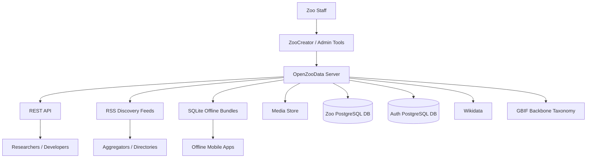
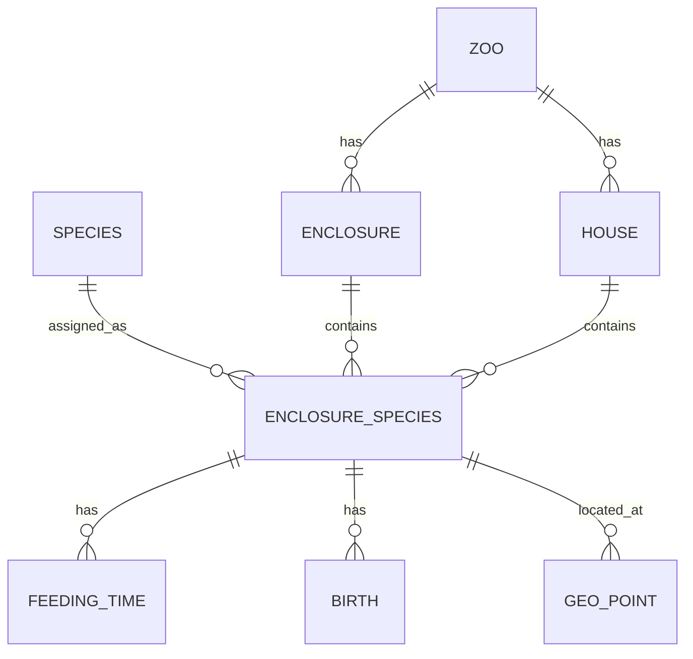
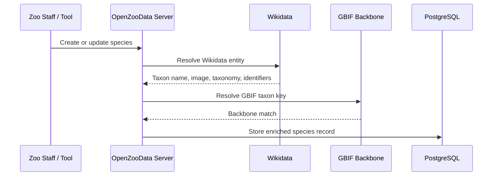
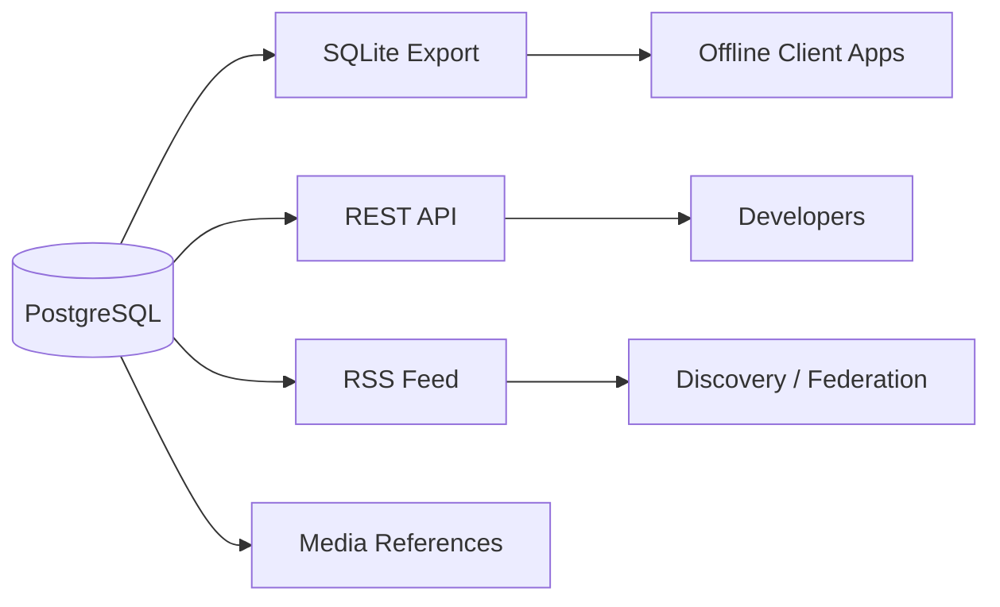

# OpenZooData Architecture

> Technical architecture and data flow for OpenZooData.

OpenZooData is designed as a federated publishing infrastructure for zoological biodiversity data. Each zoo can operate its own server, publish its own open data and remain the authoritative source for its information.

The system is intentionally built as infrastructure, not as a single closed application.

---

## Goals

OpenZooData is designed to provide:

- open REST APIs for zoo biodiversity data,
- RSS-style discovery feeds,
- offline SQLite bundles for mobile clients,
- Wikidata and GBIF enrichment,
- self-hosted institutional control,
- role-based administrative access,
- separation between open infrastructure and proprietary clients.

---

## High-Level Architecture



---

## Core Components

### OpenZooData Server

The server is the central component of each OpenZooData node.

It provides:

- public read endpoints,
- authenticated write endpoints,
- administrative endpoints,
- feed generation,
- SQLite export,
- media handling,
- health checks,
- enrichment tools.

The server is currently implemented as a Flask application with PostgreSQL.

---

### Zoo Database

The zoo database stores the actual biodiversity and zoo-specific data.

Typical tables include:

- zoos,
- species,
- enclosures,
- houses,
- domains,
- enclosure_species,
- geo_points,
- feeding_times,
- births,
- translations,
- species_texts,
- media records.

Species are globally reusable, while enclosure-specific assignments are zoo-specific.

---

### Auth Database

The auth database is intentionally separated from the zoo database.

It stores:

- users,
- roles,
- refresh tokens,
- app tokens,
- tenant relationships,
- zoo permissions.

This separation makes it easier to reason about access control and prevents accidental coupling between public biodiversity data and administrative identity data.

---

## Data Model Overview

OpenZooData distinguishes between global biodiversity entities and zoo-specific presence data.



### Species

A species is a global biological entity.

Example:

```text
Panthera leo
Wikidata: Q140
GBIF Taxon Key: 5219404
```

### Enclosure Species

An `enclosure_species` record represents the zoo-specific occurrence or presence of a species in a specific zoo context.

This distinction is important:

- the species is global,
- the presence of that species in a zoo is local,
- different zoos can host the same species independently,
- each zoo can attach its own feeding times, births, locations or local descriptions.

---

## Enrichment Flow



The enrichment flow reduces manual data entry and ensures that local zoo species records can be connected to global biodiversity infrastructure.

---

## Publishing Flow



OpenZooData can publish the same source data through multiple distribution channels:

- REST API for direct machine access,
- RSS feeds for discovery,
- SQLite bundles for offline use,
- media URLs for images and assets.

---

## Deployment Model

A typical production deployment contains:

```text
Browser / Client
      │
      ▼
Apache / Reverse Proxy
      │
      ▼
Gunicorn
      │
      ▼
Flask OpenZooData App
      │
      ├── PostgreSQL Zoo DB
      ├── PostgreSQL Auth DB
      ├── Media Directory
      └── External APIs: Wikidata, GBIF
```

Recommended production considerations:

- HTTPS enforced at reverse proxy level,
- Gunicorn as WSGI server,
- PostgreSQL with regular backups,
- rate limiting for public endpoints,
- health checks for uptime monitoring,
- separate secrets for JWT and health checks,
- non-root service user.

---

## Security Boundaries

OpenZooData separates public read access from administrative write access.

| Area | Access Model |
|---|---|
| Public zoo data | Public read endpoints |
| SQLite exports | Public or controlled by deployment policy |
| Admin endpoints | JWT authentication |
| Write operations | Role-based access control |
| Health details | Protected by health key |
| Auth database | Not publicly exposed |

---

## Design Principles

### Federation over centralization

Each zoo remains the source of truth for its own data.

### Open publication layer

OpenZooData is not intended to replace every internal zoo management workflow. It acts as a publication and interoperability layer.

### Offline-first distribution

SQLite bundles make the data usable in environments with poor connectivity.

### Linked biodiversity data

Species records are connected to Wikidata and GBIF to avoid isolated local identifiers.

### Client independence

ZooGuide, ZooCreator or future Android clients are consumers or editors of the infrastructure, not the infrastructure itself.

---

## Future Architecture Work

Planned improvements:

- Docker-based deployment,
- Darwin Core Archive export,
- improved federation registry,
- stable API versioning policy,
- expanded validation,
- richer GBIF export mapping,
- better admin UI separation,
- analytics as optional separate service.
