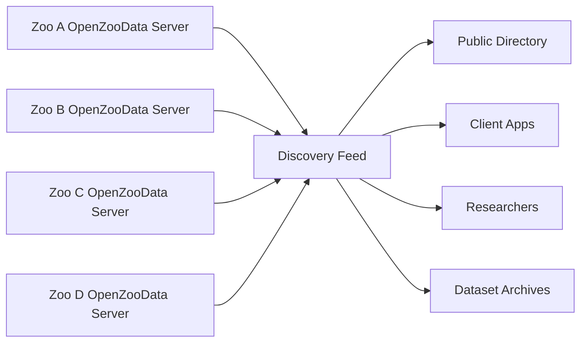
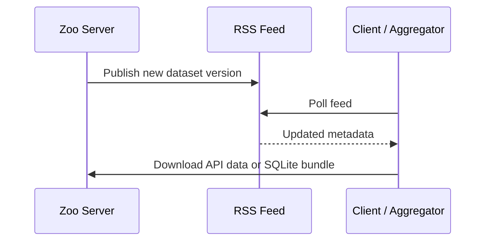

# Federation Model

> OpenZooData uses an RSS-style federation model for zoo biodiversity data.

OpenZooData is not designed as a single central database. Instead, it follows a federated model: every zoo can host its own OpenZooData server, publish its own data and remain the authoritative source for that data.

---

## Why Federation?

Zoological institutions differ in size, governance, technical capacity, legal requirements and data policies.

A centralized platform would create several problems:

- unclear data ownership,
- dependency on one operator,
- institutional trust barriers,
- difficult governance,
- potential vendor lock-in,
- single point of failure.

Federation solves these issues by allowing every institution to publish data independently while still using shared standards.

---

## Core Idea



Each zoo publishes:

- REST API endpoints,
- an RSS discovery feed,
- optional SQLite bundles,
- metadata about its own dataset.

Aggregators can discover and combine these feeds without taking ownership away from the source institutions.

---

## RSS as a Familiar Pattern

RSS is a proven pattern for decentralized publishing:

- publishers control their own content,
- subscribers discover updates,
- feeds are easy to parse,
- clients can aggregate multiple sources,
- no central platform is required.

OpenZooData applies this idea to zoo biodiversity datasets.

---

## Authoritative Source Principle

In a federated network, every zoo remains authoritative for its own data.

Example:

```text
Zoo Münster publishes Zoo Münster data.
Zoo Berlin publishes Zoo Berlin data.
Zoo Rheine publishes Zoo Rheine data.
```

An aggregator may index this information, but it should not become the canonical source.

---

## Benefits

### For Zoos

- Retain control over institutional data.
- Publish selected open data without replacing internal systems.
- Avoid lock-in to a single vendor platform.
- Participate in open biodiversity infrastructure.

### For Researchers

- Discover machine-readable zoo species data.
- Link ex-situ records with GBIF and Wikidata.
- Compare published datasets across institutions.
- Build reproducible research workflows.

### For Developers

- Consume predictable APIs.
- Build client applications.
- Use offline SQLite bundles.
- Integrate zoo data into open-data tools.

### For Visitors

- Access richer biodiversity information.
- Use offline-capable apps inside zoo environments.
- Connect local animal encounters with global biodiversity knowledge.

---

## Federation Metadata

A zoo feed should expose enough metadata for discovery and reuse.

Recommended metadata:

| Field | Purpose |
|---|---|
| Zoo name | Human-readable institution name |
| Zoo slug | Stable machine identifier |
| API base URL | REST API entry point |
| Feed URL | Zoo-specific feed |
| SQLite URL | Offline bundle |
| Updated timestamp | Change detection |
| License | Data reuse conditions |
| Contact | Responsible publisher |
| Geographic location | Optional discovery metadata |

---

## Update Flow



---

## Federation and Data Ownership

OpenZooData deliberately separates:

- publication,
- discovery,
- aggregation,
- reuse.

The source zoo publishes the data. Other systems may discover or reuse it, but the source remains identifiable.

This is important for institutional trust.

---

## Recommended Federation Rules

A federated OpenZooData network should follow these principles:

1. Keep the source institution visible.
2. Preserve dataset license metadata.
3. Preserve timestamps.
4. Do not overwrite source identifiers.
5. Link back to source feeds and APIs.
6. Treat local zoo records as institution-owned.
7. Treat GBIF and Wikidata identifiers as interoperability anchors.

---

## Future Federation Work

Planned improvements:

- public registry of OpenZooData nodes,
- feed validation,
- signed dataset metadata,
- stable dataset versioning,
- federation status dashboard,
- dataset citation metadata,
- optional Darwin Core Archive publication.
