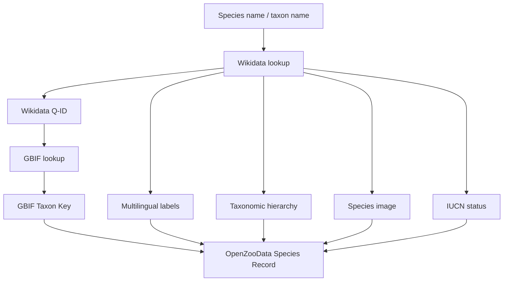

# GBIF and Wikidata Integration

> How OpenZooData connects zoo biodiversity data to the global open biodiversity ecosystem.

OpenZooData is designed to connect local zoo species records with global biodiversity identifiers and taxonomic infrastructure.

The two main external knowledge systems are:

- GBIF Backbone Taxonomy,
- Wikidata.

---

## Why GBIF?

GBIF provides global infrastructure for biodiversity data and taxonomic interoperability.

OpenZooData uses GBIF as a taxonomic anchor so that zoo species records do not remain isolated local records.

A species record should not only say:

```text
Lion
```

It should be linkable as:

```text
Panthera leo
Wikidata: Q140
GBIF Taxon Key: 5219404
```

This makes the record reusable outside the original zoo context.

---

## Why Wikidata?

Wikidata provides persistent identifiers, multilingual labels and links to many biodiversity-related resources.

OpenZooData uses Wikidata to connect species records to:

- taxon names,
- multilingual labels,
- parent taxa,
- images,
- IUCN conservation status,
- population trend,
- external identifiers,
- Wikimedia Commons media.

---

## Enrichment Strategy



---

## Typical Species Fields

A species record can contain:

| Field | Source | Purpose |
|---|---|---|
| `wikidata_id` | Wikidata | Persistent linked-data identifier |
| `latin_name` | Wikidata / local data | Scientific name |
| `german_name` | Wikidata / local data | Localized label |
| `gbif_taxon_key` | GBIF | GBIF Backbone reference |
| `iucn_status_id` | Wikidata / IUCN mapping | Conservation status |
| `iucn_population_trend_id` | Wikidata | Population trend |
| `image` | Wikimedia Commons | Open species media |
| `taxonomy` | Wikidata / GBIF | Classification |

---

## Example Species Record

```json
{
  "id": 4,
  "wikidata_id": "Q140",
  "latin_name": "Panthera leo",
  "german_name": "Löwe",
  "gbif_taxon_key": 5219404,
  "iucn_status": "VU",
  "population_trend": "decreasing",
  "source": {
    "wikidata": "Q140",
    "gbif": 5219404
  }
}
```

---

## Relationship to GBIF

OpenZooData currently uses GBIF primarily as a taxonomic interoperability layer.

The long-term direction is to support biodiversity export formats that can be mapped to GBIF-compatible publication workflows.

Potential future outputs:

- Darwin Core Archive,
- dataset metadata,
- institution-level dataset descriptions,
- ex-situ presence records,
- public dataset registry.

---

## Ex-situ Biodiversity

Most biodiversity infrastructure focuses on wild occurrences, observations, specimens or checklists.

Zoo collections represent a different type of biodiversity data:

- living animals,
- managed populations,
- ex-situ conservation,
- enclosure-based presence,
- breeding records,
- visitor-facing education.

OpenZooData does not claim that a zoo animal is equivalent to a wild occurrence record. Instead, it treats zoo species data as structured ex-situ biodiversity information that should be published clearly and with appropriate context.

---

## Data Modeling Considerations

Important distinctions:

| Concept | Meaning |
|---|---|
| Species | Global taxonomic entity |
| Zoo | Publishing institution |
| Enclosure species | Zoo-specific presence of a species |
| Birth record | Managed-population event |
| Feeding time | Visitor and husbandry-related schedule |
| Geo point | Local zoo map position |
| Media | Image or asset associated with record |

This model avoids confusing global taxonomy with local zoo presence.

---

## Future Darwin Core Mapping

A future Darwin Core export should be designed carefully.

Possible mapping areas:

| OpenZooData | Darwin Core idea |
|---|---|
| Species | Taxon |
| Zoo | Institution / dataset publisher |
| Enclosure species | Ex-situ presence concept |
| Birth | Event-like extension |
| Geo point | Local site coordinate, not wild occurrence |
| GBIF taxon key | Taxon identifier |

The export should avoid misrepresenting zoo animals as wild occurrence records.

---

## Recommended Principles

OpenZooData should follow these principles when integrating with GBIF:

1. Preserve the distinction between wild occurrence and ex-situ presence.
2. Use GBIF taxon keys for taxonomic interoperability.
3. Use Wikidata Q-IDs for linked-data interoperability.
4. Keep source zoo identity visible.
5. Publish clear license metadata.
6. Avoid overclaiming scientific meaning of visitor-facing data.
7. Support future standardized export formats.

---

## Open Questions

Future work should clarify:

- best GBIF-compatible representation for live zoo presence,
- whether a Darwin Core extension is appropriate,
- how to describe managed ex-situ populations,
- how to represent enclosure-level data,
- how to cite federated zoo datasets,
- how to validate taxonomic mappings.
